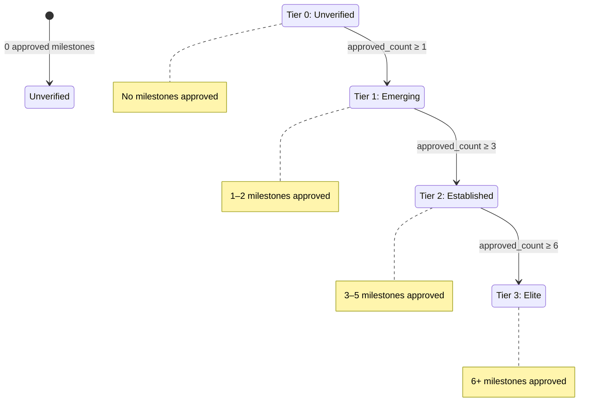

# Player Tier Promotion

Players carry a tier, stored as the integer `progress_level` (0–3) on the
`players` table. A player's tier reflects how many of their submitted milestones
the contract has approved.

## Tier Taxonomy

The four tiers, their canonical names, and one-line descriptions are:

| Level | Name        | Description                                                       |
| ----- | ----------- | ----------------------------------------------------------------- |
| 0     | Unverified  | Player has registered but no milestones have been approved yet    |
| 1     | Emerging    | At least one approved milestone — initial ability confirmed       |
| 2     | Established | Multiple approved milestones — consistent performance on record   |
| 3     | Elite       | Six or more approved milestones — top-tier verified performance   |

> **Note:** The code-level unification of tier logic into a single shared module
> is tracked separately (see the canonical state-machine refactor issue). This
> table is the single source of truth for human-readable names and descriptions
> until that work lands.

## Criteria and Thresholds

Tier is derived **purely from the number of `milestone_approved` events recorded
for the player**. A player holds the highest tier whose minimum-milestone
threshold their approved count meets or exceeds:

| Approved milestones | Tier | Label       |
| ------------------- | ---- | ----------- |
| 0                   | 0    | Unverified  |
| 1–2                 | 1    | Emerging    |
| 3–5                 | 2    | Established |
| 6 or more           | 3    | Elite       |

### Threshold Definition (Single Source of Truth)

The exact thresholds are defined once, as a read-only data structure, in
[`src/services/tierPromotion.ts`](../src/services/tierPromotion.ts):

```typescript
export const TIER_THRESHOLDS: ReadonlyArray<TierThreshold> = [
  { tier: 3, minApprovedMilestones: 6 },
  { tier: 2, minApprovedMilestones: 3 },
  { tier: 1, minApprovedMilestones: 1 },
  { tier: 0, minApprovedMilestones: 0 },
];
```

This array is ordered highest-tier-first; `tierForApprovedMilestones(count)` 
returns the first tier whose `minApprovedMilestones` threshold the player's 
count meets or exceeds.

**To retune promotion**, operators need only edit `TIER_THRESHOLDS` in that file.
No other code changes are required: the indexer, tier-computation function, 
and all tests consume the same source of truth.

### State Machine and Transitions



Tier can only increase (or stay the same) when `milestone_approved` events are 
added. In practice, demotions never occur because the event log is immutable.

These transitions show the backend promotion model implemented by
`tierForApprovedMilestones`. Product-facing material may describe levels 1 and
2 with additional conditions (KYC, academy status, etc.), but in the backend 
these transitions depend only on the recorded `milestone_approved` count.

## Promotion Trigger and Recompute Flow

### Indexer Integration

The indexer ([`src/services/indexer.ts`](../src/services/indexer.ts)) is 
responsible for computing and applying tier changes. When processing a batch of 
events, if a `milestone_approved` event is encountered:

1. The event is persisted to the `events` table (with automatic dedup on `tx_hash` 
   via `INSERT OR IGNORE`).
2. The event's `player_id` is extracted from the payload.
3. A new query counts **all** `milestone_approved` events for that player:
   ```
   SELECT COUNT(*) FROM events 
   WHERE type = 'milestone_approved' AND payload->>'player_id' = ?
   ```
4. `tierForApprovedMilestones(count)` computes the player's new tier from this count.
5. `updatePlayerProgress(playerId, newTier)` writes the tier to `players.progress_level`.

### Non-Authoritative Tier Storage

**Important:** `progress_level` on the `players` table is **not authoritative**. 
The true tier is always recomputed on-the-fly from the event log. This design 
ensures:

- **Idempotency**: Replaying a ledger range (during backfill or re-indexing) 
  re-counts the same events and arrives at the same tier. No double-counting 
  or accidental demotions occur.
- **Audit trail**: The complete history of approved milestones is recorded in 
  the immutable `events` table. Operators can verify any player's tier by 
  counting their events.
- **Reconfigurability**: If `TIER_THRESHOLDS` is changed, all players' tiers 
  automatically reflect the new thresholds on the next re-index or event 
  recompute.

### Cache Invalidation

After a player's tier is updated, the player cache is invalidated to ensure 
that subsequent queries reflect the new tier immediately:

```typescript
const cache = getCache();
cache.invalidatePlayerCache(playerId);
```

See [`src/services/cache.ts`](../src/services/cache.ts) for cache TTL 
configuration (`PLAYER_CACHE_TTL_MS`, default 60 seconds), backend selection 
(Redis or in-memory), and namespace management.

## On-Chain vs Off-Chain Tier

**On-chain tier** (stored in the Soroban contract) may enforce additional 
conditions—such as time-based requirements, off-chain verification, or 
staking—beyond the simple milestone count.

**Off-chain tier** (stored in `players.progress_level` and computed here) is 
derived **only** from the milestone approval count as described in this document. 
The two may diverge if:

- The contract enforces additional conditions not reflected here.
- The contract state and this backend's event log become out of sync.
- `TIER_THRESHOLDS` are changed without corresponding contract updates.

For the canonical on-chain and off-chain tier relationship and architecture, 
refer to the contract specifications and the canonical taxonomy issue tracked 
in the repository.

## Trial Offer Expiry and Cancellation

A trial offer is a time-sensitive, real-world proposal. The platform
enforces two guards to prevent stale or unintended offers from being acted upon.

### Expiry

Every new trial offer receives an `expires_at` timestamp at creation time:

```
expires_at = created_at + TRIAL_OFFER_TTL_MS (default: 30 days)
```

Setting `TRIAL_OFFER_TTL_MS=0` disables automatic expiry (not recommended
for production). After `expires_at`, any accept or reject attempt by the
player returns **410 Gone** with `error: "Trial offer has expired"`.

Rows created before this feature was deployed (`expires_at IS NULL`) are
treated as non-expiring for backward compatibility.

### Cancellation (scout withdrawal)

The originating scout may withdraw a **pending** offer at any time before
the player responds:

```
DELETE /api/scouts/:wallet/trial-offers/:offerId
```

| Condition | Status |
| --------- | ------ |
| Offer is pending | 200 — cancelled |
| Offer already accepted/rejected | 409 — Conflict |
| Offer already cancelled | 409 — Conflict |
| Offer belongs to another scout | 403 — Forbidden |
| Offer not found | 404 — Not Found |

After cancellation the player's accept and reject attempts return
**410 Gone** with `error: "Trial offer has been withdrawn by the scout"`.

### State machine

```
pending ──(player accepts)──► accepted
        ──(player rejects)──► rejected
        ──(expires_at past)──► [expired, immutable]
        ──(scout cancels)───► cancelled
```

Expired and cancelled offers are terminal: no further transitions are
possible. The `cancelled_at` column records when the scout withdrew the
offer; `expires_at` records the deadline set at creation.
