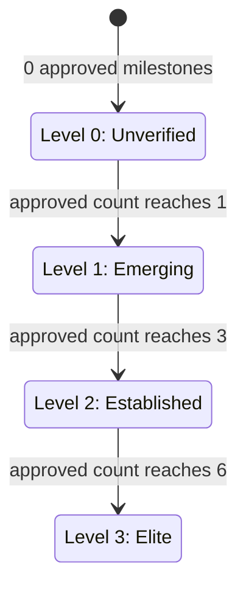

# Player Tier Promotion

Players carry a tier, stored as the integer `progress_level` (0–3) on the
`players` table. A player's tier reflects how many of their submitted milestones
the contract has approved.

## Criteria

Tier is derived **purely from the number of `milestone_approved` events recorded
for the player**. A player holds the highest tier whose minimum-milestone
threshold their approved count meets or exceeds:

| Approved milestones | Tier | Label       |
| ------------------- | ---- | ----------- |
| 0                   | 0    | Unverified  |
| 1–2                 | 1    | Emerging    |
| 3–5                 | 2    | Established |
| 6 or more           | 3    | Elite       |

The thresholds are defined once, as data, in
[`src/services/tierPromotion.ts`](../src/services/tierPromotion.ts)
(`TIER_THRESHOLDS`). The indexer and the tests both consume that single source
of truth, so retuning promotion is a one-line change to the thresholds.

## TIER_THRESHOLDS Configuration

The thresholds are stored as a configurable constant array in
`src/services/tierPromotion.ts`:

```typescript
// Each entry maps a tier level (index) to the minimum approved
// milestone count required to reach that tier.
export const TIER_THRESHOLDS = [0, 1, 3, 6];
//                              ^  ^  ^  ^
//                              0  1  2  3  = tier (progress_level)
```

| Index | Minimum approved | Tier label   |
| ----- | ---------------- | ------------ |
| 0     | 0                | Unverified   |
| 1     | 1                | Emerging     |
| 2     | 3                | Established  |
| 3     | 6                | Elite        |

### Changing thresholds

To adjust promotion criteria, edit `TIER_THRESHOLDS` in
`src/services/tierPromotion.ts`. No other code change is required — the
`tierForApprovedMilestones(count)` function walks the array from high to low,
returning the first tier whose threshold is ≤ the player's approved milestone
count. The indexer, tests, and any other consumers all reference this single
array.

After changing thresholds, players already above the new cutoff for their
current tier **are not automatically demoted**. Demotion only occurs if a
reindex is run that reprocesses their events with the new thresholds and a
player's approved count now falls below their current tier's minimum.



These transitions show the backend promotion model implemented by
`tierForApprovedMilestones`. Product-facing material may describe levels 1 and
2 as "Verified Identity" and "Performance Milestones", but those labels do not
add KYC, academy, footage, or trial-offer conditions to this service. In the
backend, only the recorded `milestone_approved` count controls these transitions.

## When promotion happens

Promotion is applied by the indexer ([`src/services/indexer.ts`](../src/services/indexer.ts))
as it processes events. For every `milestone_approved` event:

1. The event is persisted to the `events` table.
2. The indexer counts the player's total approved milestones
   (`getEvents('milestone_approved')` filtered by `player_id`).
3. `updatePlayerProgress(playerId, tierForApprovedMilestones(count))` writes the
   resulting tier to `players.progress_level`.

Tier is **recomputed from the authoritative event count** rather than trusting a
`progress_level` field on the event payload. Because the `events` table dedups on
`tx_hash` (`INSERT OR IGNORE`), replaying a ledger range is idempotent — a player
can never be double-counted or demoted by a re-index.

## Off-chain vs on-chain tier

The `progress_level` stored in `players.progress_level` is an **off-chain
cache**. It is recomputed whenever the indexer processes a `milestone_approved`
event and is therefore always eventually consistent with the on-chain event
count. Between a milestone approval on-chain and the indexer processing it,
the cached tier may be stale (a few seconds under normal operation, longer if
the indexer is catching up after a restart).

The `GET /api/players/:playerId` endpoint reads `players.progress_level`
directly (the cached value). To force an immediate refresh without waiting for
the next on-chain event, trigger a reindex covering the player's recent
ledger range (see [docs/reindexing.md](reindexing.md)).

## Cache invalidation

When a promotion occurs (the player's tier increases), the following caches are
invalidated:

1. **Player detail cache** (`GET /api/players/:playerId`) — invalidated
   immediately after `updatePlayerProgress` writes the new tier.
2. **Player list cache** (`GET /api/players`) — invalidated on the next
   indexer sweep if any player's tier changed during the sweep.
3. **Scout subscription relevance cache** — tier changes may affect which
   players match a scout's saved search filters; these are re-evaluated on
   the next subscription check interval.

There is no in-process cache beyond per-request memoisation, so a restart
always serves fresh tier data from the database.
